# Documentation
## Interface
### Basic UI information
#### Left Panel : 
##### Importing Assets: 
There are few different way to import your assets in PNGTube-Remix. one of the easiest way is from Files>Import then select the Object type you need.

Another quick way is from the buttons on top of the layers tree in the Left Panel.

##### Image Preview:
You can Drag and Drop from your File Manager/ Images onto the Previews to set the Objects's Image or Normal Map to one of the Images you have imported there.
- Image : Previews your current selected Object.
- Normal Map : Previews the Normal Map of your selected Object.

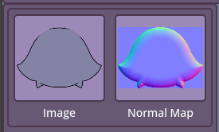

##### Layers Tools:

(in order from Top row)

- Unlink/ Unparent : Unlinks your Object from its current parent and sets its new parent to the SpriteHolder.
- Comment Block : A Debug Object type that lets you add comments for your Model. The same block can be reused in different states with different comments in it.

- Flip Horizontally : Enables you to Flip non-animated Images horizontally.
- Flip Vertically : Enables you to Flip non-animated Images Vertically.
- Image Rotation : Enables you to Rotate non-animated Images Clockwise.

- Add Sprite : A quick shortcut to add a new Sprite Object.
- Add Appendage : A quick shortcut to add a new Appendage Object.
- Add Folder : Folders are very much empty Sprite Objects that can still be used as a Sprite Object, just without any textures asigned to it.

- Replace Image : Lets you replace the current used Image of the Selected Object.
- Duplicate Objects : Enables you to duplicate the current selected Object(s) and its(their) hierarcy in the Layers Tree.
- Delete Object : Deletes your selected Object(s).

- Add Normal Map : Allows you to select an Image from your file system to be used as a Normal Map.
- Remove Normal Map : Removes the Normal Maps of the current selected Objects.

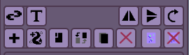

##### Layers:

This is where you edit your Object hierarcy in the scene/ model. You can do so by dragging and dropping the Tree Layer items around. Dropping on the "Model" item sets the Object's parent to the SpriteHolder.

You can also collapse the Tree items if you want

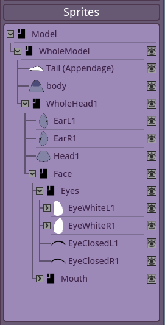

##### File Manager:

This is a newly introduced feature in V1.4.x. 

You can from here check the amount of used Images and reuse them in your Model without having to reimport them again. You can directly add new Images from the File Manager 

(Which won't be added to the scene unless you dragged and dropped it on the scene/ Model view area). 

You can Replace the Image here too, which any item that uses that image data will automatically update to the newly replaced data.

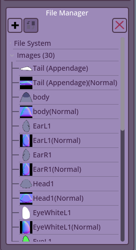

#### Right Panel : 
##### Properties : 

- Object Naming : You can rename your object after importing, when you finish, make sure to press enter for the change to apply
- Sprite ID and Parent ID : While for a users it is useless, it personally helps me debug issues users might be having with parenting and such.

- Color : Modulate/ Tints the object.

- Blend : Blend-Modes like Add, Multiply, etc  

- Z-Order : The order of the sprite, think of it like  
  Changing the layer of your drawings, but it is way  
  more free since it doesn’t fully depends on what  
  object it is connected/ linked to.  
  
- Pos-x, y and Rotation : You can manually change  
  the position and rotation from these.  
  
- Offset : Change the sprite’s rotation point.  

- Size-x, y : Changes the size of the object.  

- Visible : Changes the main visibility of the object.

- Flip Horizontally/ Vertically : Flips your Object and its children on the H or V axis.

- Assets : Will talk more about later.

- Cycles : Cycles are designed for users with so many assets that it becomes hard find good keybinds and such for. So for that case, you assign the assets to a cycle that you can toggle on/ off (randomly shows one of the items) or cycle through them forward or backward depending on the order. Will also discuss later.

---
**Debug section**

This section is designed for more test and general model optimization.  
  
Some users reported their models getting laggy and that is due to the amount of calculations running.  
  
The fix for that is being able to disable/ set the feature to rest mode.  
  
You can also use this section to toggle on something like Hidden Item, which makes it invisible in Preview mode, but its effects on children Objects still apply, etc.  

---
  
Now here is where things get interesting!
- Should Blink:
  if the Toggle is true, the object would be considered to be a part  
  of the eyes. Checking Eye Open means the current selected  
  object is/are open eyes, if unchecked, it means closed eyes.  
- Should Talk:  
  Same thing as the Eyes toggle, but for the mouth.  

You could always experiment with them. Despite thing software mainly  
focusing on rigging, this doesn’t mean you can’t make simple PNGTuber  
models like the ones seen in VeadoTube Mini and Gazō-Tuber  
(Links if you are curious, feel free to check them out too VeadoTube , Gazō  Tube).  

- Ignore Bounce:  
  Ignores Global bounce. Let’s say your sprite squishes, but you don’t want it to squish even more when the model bounces. You simply toggle this to prevent that from happening. Td;lr the part(s) don’t get affected if the model is bouncing, etc..
- Physics:  
If this is on, the object’s movement gets affected by the parent’s Y-axis movement. This could be used to add more flavor to your model!

##### Ignore Bounce Example:
|  Ignore Bounce On  |  Ignore Bounce Off  |

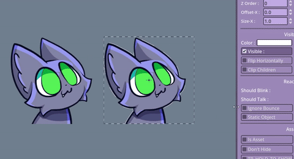

##### Physics Example:
|  Physics On  |  Physics Off  |

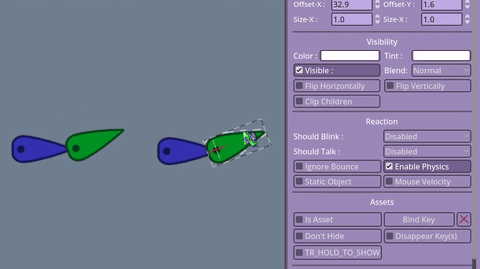

##### Clip Children:
> Sadly I am unable to find a good way to implement Clipping Masks.  
The only current way to clip stuff is to make the object a child of  
what you want to clip the object to and enable Clip Children on  
the parent object.  
This is a limitation I hope to be able to solve in the future 😇 

##### Assets
Assets and Asset Toggles. Assets can be used on any Object Type. They are completely separate from States too. You need to keep in mind that an asset's toggle key and data is shared between all States.

- Is Asset : This is where you can make the Object an asset. Next to it is the keybind corresponding to this asset.
- Don't Hide : Asset toggles.. are toggles, but sometimes you don't want the asset to hide again by pressing the same toggle button.
- Show on Hold : This features make your asset only show as long as your toggle key is held. When released, the asset gets hidden again.
- Disappear key(s) : This feature is for assets that might need to be hidden by other assets being shown or for any general reason. the Key(s) is because you can assign more than one Disappear key to the same Asset Toggle(s).

##### Basic movement concepts
Movements in PNGTube-Remix work using the concept of Sine Movement/ Sine Waves.
- X-Amp : The amound of amplitude the object moves to on the x-axis.
- X-Freq : The frequency of movement on the object per second on the x-axis.
- Y-Amp : The amound of amplitude the object moves to on the y-axis.
- Y-Freq : The frequency of movement on the object per second on the y-axis.

- Drag : The amount of Weight/ drag you want to add to an object. The higher the Drag, the move weighted it feels.
- Drag Snap : Sometimes your object may move a lot between states which could lead to the Drag breaking your model due to the sudden position jump, this parameter fixes it by defining the max distance of the Drag before snapping to the current Object position.
- Stretch : the amound of stretch/ squish your object would have.
- Index X and Index Y : The dynamic change of the object's index depends on how close/ far the movement is from the origin.

- Min and Max Rot : the minimum and maximum rotation threshold the object can reach before stopping.
- Rot-Degree : The amount of rotation applied on the object.
- Rot-Freq : similar to Freq X and Y, but for rotation.
- Rot-Speed : the speed by which the Auto Rotation rotates in.
- Auto Rotate : Self explanitory..

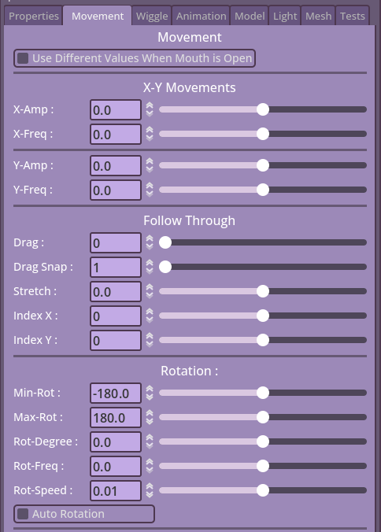

**Follow Section**
- Follow Options : For the position, rotation and scale, you can choose different tracking options. Mouse, keyboard, etc..
- Delay : The amount of delay you want between your tracking and object reaching its target position.
- Range X and Y : How far (both positive and negative) should your object travel following your tracking movement. Values in the negative reverses the movement.
- Min-Rot and Max-Rot : the minmium and maximum amount of rotation your object should rotate depending on how close/ far it is from the tracked movement.
- Squish X and Y : Same as the rotation, but for the scale.
- Snaps : Position, Rotation and Scale snapping is for tracking like keyboard/ controller movement where it stays in place after the input stopped.
- inverting : Inverses the follow motion for Position or Scale.

---

##### Wiggle

**Follow Appendage Tip**
- Follow Appenage : If the Object is a child of an appendage, this feature allows the object to follow one of the appendage points. V1.4.1 onwards will allow you to reposition the object anywhere. Allowing the user to follow a specific point without being fully bound to it.
- Point : The point on which the object follows.
- Strength : The follow strength of the object (affects how harshly it rotates.)
- Rot-Threshold : The threshold of movement needed by the object to start following the rotation again.

**Wiggle Sprite**
- Wiggle Sprite : Enables the sprites wiggling/ wobbling feature.
- Wiggle Physics : Enables physics on wobble sprites where the parent movement affects the wobbling.
- X and Y Offset : the offset position on the wiggling UV map (since this feature uses Shaders.)
- Wiggle Amp and Freq : Similar to the X and Y Amp/ Freq, but be careful since it is a bit more sensitive.

**Wiggle Appendages**
- Auto Wag : Enables auto wagging, this feature, however disables the Curvature. 
- Curvature : The amount of curve applied on your appendage, good for curly hair pieces or tails.
- Segments : The amount of segments your appendage has, each segment is equal in size and has sub-divisions applied to each equally.
- Stiffness : How soft/ stiff the appendage is to movement.
- Phys-Stiff : This features defines how much stiffness the parent's movement effect should be on the child (appendage.)
- Comeback : The comeback speed of the appendage to its rest position.
- Momentum : The angular momentum of the appendage. in simple terms, how hard the movement is.
- Damp : How snappy it is while moving/ going to rest position.
- Width and Length : do i need to say anything?
- Gravity X and Y : The gravity can be either positive or negative, this could make the appendage attempt to float up or fall down by being pulled by the gravity.
- Sub-Division : The amount of divisions/ points on your appendage per segment.
- Angle : This can be used to rotate the appendage/ set its angle without having to fully rotate the object.
- Closed Loop : Closes your appendage into a loop. Connects the beginning with the end.
- Keep length and Max Stretch : These two are related, since sometimes, you may not want your appendage to stetch past a threshold/ keep its length, these two parameters are for that.
- Anchor : The target anchor for the appendage turning it into a rope. Note : if two target objects share the same name, only the first one will appear on the list, keep that in mind..
- Texture mode :  Either stretch the texture onto the appendage or tile it, tiling can be useful for something like chains.
- Mirror Reaction H : Honestly, don't remember, need to check the code again. I think it was a test feature I forgot to remove.
  
#### Note
When setting up the appendage, make sure that the tip of the appednage/ tail is pointing to the right.
 Here is an example of how some appendages look 

Example Tail and Hair piece.

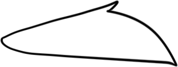
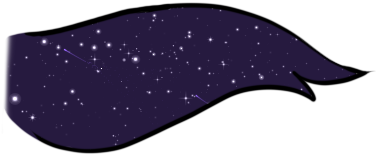

Remember to check [Original Wiggle Appendage](https://github.com/Tameno-01/GodotWigglyAppendage2D).  
Check this [Basic Appendage Parameters for Artists](https://github.com/Tameno-01/GodotWigglyAppendage2D/blob/main/docs/parameter_decriptions.md)  

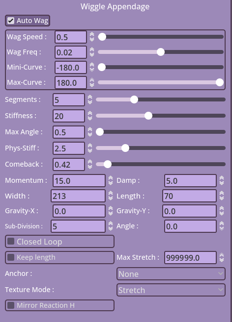

---

##### Test
Here, new features are usually added for testing before becoming official. Honorable mention : Advanced Lipsync.

---

### Editing States
In V1.4 onwards, assigning Input Keys/ renaming States is done from the Remap button ontop of the states as shown here, not from settings. Don't forget to press enter after renaming your State.

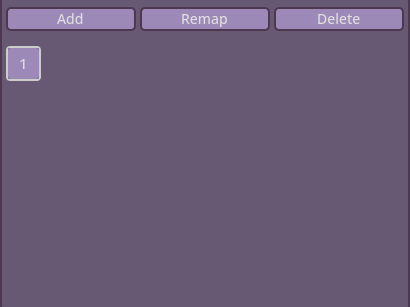

---

### Top Panel

#### Files

- New : Opens a new file for you to create a new model in.
- Open : For loading existing Models.
- Save : Saves your current Model.
- Save As : Saves your model to a new location.
- Import : You can import Sprites and/ or Appendages or load a PSD file.
- Demo Models : Some sample demo models of Pickles the Cat.
- Lipsync Configuration : Opens a window where you can setup your lipsync data.
- Quick Save and Reload : A quick hot reload for your current model. Can be used to reset Animations sync.
- Model Optimizer : WARNING THIS CAN BREAK YOUR MODEL IF YOU AREN'T CAREFUL ENOUGH. This opens a popup where you can Trim/ Resize your model.
- Export Model Parts : Exports all the images currently used in your model (or that exists in the File Manager in general).

##### Save and Load
To Save and Load your model, you go to Files > Save/ Files > Save As and for loading, you go to File > Open.

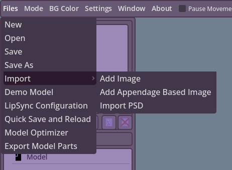

---

#### Pause Movement 

Previously Static View, this feature can be used to freeze your model to allow you to accurately edit object placements and offsets.

#### Show UI 

An editor only toggle that allows you to quickly hide the ui without having to go to preview mode.
