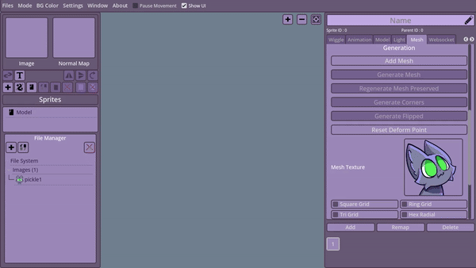
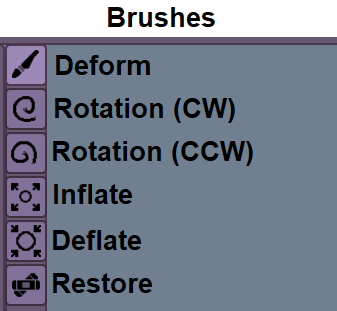

**MESHES ARE EXPERIMENTAL.**

**Only usable/ enabled from Developer Mode**

- Deform : Enables/ Disables the mesh editing.
- Show Web : Shows the internal web/ connections between the mesh points.
- Influence : The brush influece size.
- Strength : The strength of the brush when moving points.
- Wobble Movement : Enables/ Disables if the the mesh should move with the X/Y Freq/ Amp while animating or animates in place.
- Follow Movements : Enables/ Disables if the the mesh should move with the follow movement ranges while animating or animates in place.
- Phyiscs Effects : The amount of physics reaction applied on a parented mesh on the X/Y, check the enable physics from properties.
- Mesh Grid : This grids holds all the points that you can animate. It has 9 points that can hold animated data.
- Target Mesh : Links two meshes together/ sets allows a mesh to be used by another mesh.
- Add Layer : Adds a new deform layer.
- Delete Layer : Deletes currently selected deform layer.
- Target Strength : The strength of the current selected layer on the total animation/ movement.
- Stiffness : The how soft/ hard the mesh is.
- Damping : the dampness of the mesh.
- Mass : How heavy/ lightweight the mesh is.
- Follow Speed : idk, self explanatory. (Check Motion Type)
- Noise Speed : The speed of the noise cycle. (Check Motion Type)
- Noise Scale : The scale the noise map used for randomized mesh movement.
- Sine Speed : The speed of the sine wave for the sine motion type.
- Sine Amp : The amplitude of the sine wave for the sine motion type.
- Motion Type : The motion/ physics type of the current selected layer.

--

##### Mesh Generation

- Grid Size : The size of the grids of the generated mesh.
- Radial Spacing : the space between rings in radial generated meshes.
- Alpha threshold : The alpha detection in a texture during generation.
- Inner Points : The amount of inner points in the generation.
- Eplision : Similar to alpha threshold, but for polygon generation.
- Merge Points Space : Detects how close two points are and if they are in range, they get merged into 1 point.
- Smooth Iterations : The smoothness of the generated mesh.

How to add a new Mesh:

Tools: 

