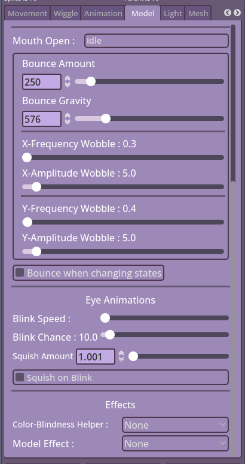

## Animation
This section is for controlling the Sprite-Sheet, Gif and APNG animations and few misc stuff.
- Horizontal and Vertical Animation Frames : these are used for Sprite-Sheets, can be used on horizonal, vertical or grid sheets.
- Animation Speed : The speed in which your animated sheet plays.

- Reset Animation : Resets the animation if it was hidden then shown again.
- One shot : Makes the animation only plays once if hidden then shown again.
- Reset on State Change : Similar to Reset Animation, but only if the State is changed.

- Rainbow : Enables the RGB/ Rainbow Effect
- Self Rainbow : Only makes the effect work on the Object and not its children.
- Rainbow Speed : The speed of the RGB cycling.

**Sprite-Sheet Specifics**

- None Animated Sheet : This feature freezes the Sheet, so you can pick which frame you want to show. Useful for customizable models.
- Frame : The frame of the frozen sheet you want to show.
- Animate to mouse : You may want to animate your sheet to the mouse/ Tracking X/ Y movements.
- Move with Mouse : You can disable the movement with the tracking which makes the sheet stay in place, but still cycles through its animations with the movement.
- Animation Speed : How fast the frame cycles to the tracked movement.

**Misc Animations**

- Fade : Makes the Object fade in/ out whe being hidden/ shown.
- Fade Asset : Same as Fade, but only on Assets.
- Fade (Slider) : The Speed of the fade.
- Fade Asset (Slider) : The Speed of the Asset Fade.

---

## Model

**Model Animations**

- Mouth Closed/ Open : Either of these lets you choose the animations you want to apply on the model when talking/ not talking.

- Bounce Amount  : The amount of force your model jumps when the Bounce or Bounce Once are used.
- Bounce Gravity : The amount of gravity/ pull force that the model falls by after bouncing.

- X-Frequency Wobble : The Frequency of the Model Shaking on the x-axis.
- X-Amplitude Wobble : The Amplitude/ Height of the Model Shaking on the x-axis.
- Y-Frequency Wobble : The Frequency of the Model Shaking on the y-axis.
- Y-Amplitude Wobble : The Amplitude/ Height of the Model Shaking on the y-axis.

- Bounce When State Changes : Makes your model bounce on changing states. Completely dependent from the Model Animations.

**Eye Animations**

- Blink Speed  : The Speed of the Model blinking.
- Blink Chance : The Blink chance (1 in x chance for blinking)

- Squish Amount   : The amount of squish applied to your model at the center of the Sprite Holder.
- Squish on Blink : Enables the Squishing feature when the model blinks.

**Effects**

- Color-Blindness Helper : This was a feature requested to help make your model visually friendly to people with color-blindness.
- Model Effects : Some effects to you apply on your entire Model, not per Object.

---

## Light
Light can be used with the Normal Maps feature to give your model a dynamic light effect. Lights can still be used without Normal Maps, however.

- Light Visible : Enables/ disables the Light feature.
- Light Shape Visible : Shows where the Light is coming from using a small light indicator.

- Light Color : The color of the Light source.
- Darken : Darkens your model when not talking. When speaking, your model becoming lighter again then fades back to darkened.
- Darken Color : Next to the toggle, you change the darkening color.

- Pos-X : The position of the light source on the x-axis.
- Pos-Y : The position of the light source on the y-axis.

- Blend : The blend mode of the Light source (Mix, Add, Subtract).

- Light Energy : The energy of the emitted light from the source.
- Light Size : The size of the Light source.

---
