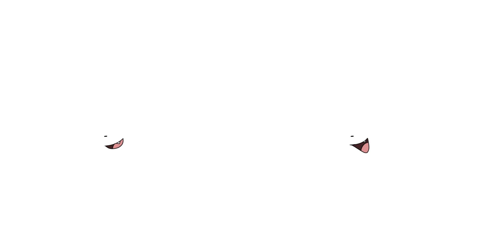
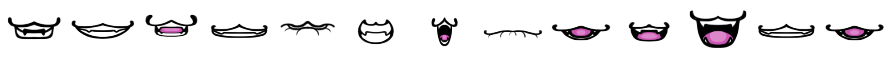
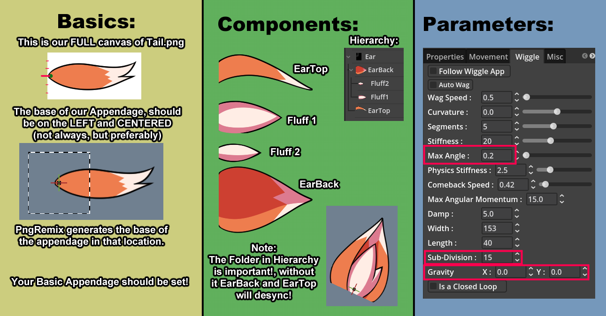
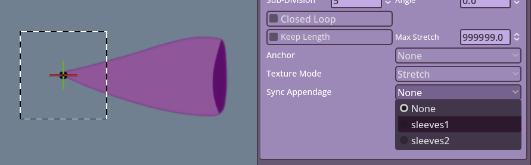

## Basic Tutorials

### SpriteSheet Cheat-Sheet

#### Websites for compiling sheets 

- [Codeshack](https://codeshack.io/images-sprite-sheet-generator/)
- [MouthStitcher-Remix](https://olypolyu.github.io/MouthStitcher-Remix/)

#### Optimization

This is a common issue seen with users. Where to make sure things are placed correctly, the canvas size is huge across all the cells of the sheet.  
Here is an example of a bad SpriteSheet.  

It is heavily preferred to cut down on empty space around your sheet.  
Here is an example of a proper sheet.

Notice how the second one feels more compressed. While this might appear bad since you will have to adjust the position manually.  
It really isn't, since due to possible hardware limitations (check [FAQ](faq)), this could in fact allow you to have more frames  
in your sheet without much issues.  
PNGTube-Remix supports horizontal, vertical and grid based sheets. This should be helpful for longer animations.  

- Horizontal: From left to right.
- Vertical: From top to bottom.
- Grid: Top-Left to Bottom-Right.

---

## Appendage Tutorials

Of course make sure to check Remember to check [Original Wiggle Appendage](https://github.com/Tameno-01/GodotWigglyAppendage2D).  
Check this too [Basic Appendage Parameters for Artists](https://github.com/Tameno-01/GodotWigglyAppendage2D/blob/main/docs/parameter_decriptions.md)  

### Community Tutorials 

#### Stalx's Wobbly Animal Ears

Credits to [Stalx](https://x.com/Stalxth)

We will be adressing Segments of the Image by color.
What is an Appendage? A really cool Thingy.png that wiggles and twirls.

**Yellow Segment**

If your Appendage ever feels like it looks to pixelated, make sure to go to Wiggle and Add a bit more Sub-Divisions to it, I usually do 15.

**Green Segment**

For this short tutorial on how to make use of appendages in a more advanced way, we will be doing a 4 component Fox Ear.
DO NOT MOVE ANYTHING UNTIL YOUR HIERARCHY IS SET UP.

Components:
- EarTop
- Fluff 1
- Fluff 2
- EarBack

---

The hierarchy for this will be the following, Note that the Folder is important! as it will help sync the wiggle of EarTop and EarBack.

- Ear(Folder)
- EarBack
- Fluff2
- Fluff1
- EarTop

---

Once we have the hierarchy set up, we can finally move and adjust everything, let's click our Folder, Properties > Rotation: -65.0.  
And let's move Fluff2 a bit, Pos-X: 3, Pos-Y: 20 and lastly.. Rotation: 15.  

Now let's move on to the Wiggle tab.  
For now we will only move Max Angle, Sub-Division, and Gravity  
first, let's do Sub-division, you want to reach the point where it stops looking pixelated when it wobbles. 15, is my go to, let's set all of the Component's Sub-div to that.  
but now we have a problem, it wobbles a bit to much inwards and looks weird right? let's fix that.  
Max Angle, your EarBack and EarTop should have the same values in EVERYTHING, otherwise they'll desync **(A recent release fixed the desync issue. Please check the next section)**.  
let's do 0.2 Max Angle for these two, as for the Fluffs, we will set up the Fluff1 to 0.3 and the smaller Fluff2 to 0.5. We're pretty much done, Gravity can help you give some curve, so be creative with it!  

---

### Tips

#### Appendages Syncing

Sometimes you might need your appendages to sync. This is very important to achieve specific effects.  
What you do is:
- Import your appendages.
- Make sure they are the same image size and if possible same parameters.
- Go to the settings and look for **Sync Appendage**.
- Make sure to select the other one that you need to sync the selected with.

